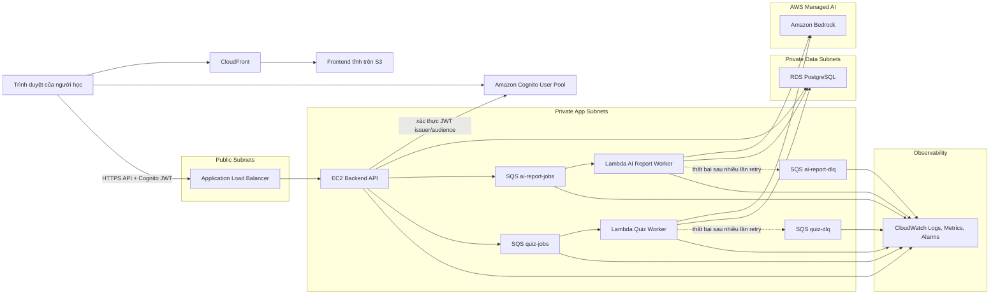

# Kiến Trúc LearnFlow AI Dashboard

## 1. Tóm Tắt Hệ Thống

LearnFlow AI Dashboard là một hệ điều hành học tập cá nhân, dùng để ghi lại nhật ký học tập, xem lại các insight do AI tạo ra, tìm lại ghi chú cũ, luyện tập bằng quiz, và theo dõi tiến độ học tập. Repo hiện tại là frontend Vite/React, với phần xác thực Cognito đã được chuẩn bị trong code, cùng các ghi chú tích hợp AWS cho backend trong tương lai.

Tài liệu này mô tả kiến trúc AWS mục tiêu, được suy ra từ các tài liệu sản phẩm, các route frontend, và các file ghi chú `.aws-docs/` hiện có.

## 2. Trích Xuất Thành Phần

### Client / Frontend

- Ứng dụng SPA React + TypeScript được phục vụ dưới dạng static assets.
- Điều hướng desktop dùng sidebar trái cố định; mobile dùng bottom navigation.
- Các route chính:
  - `/`
  - `/journal/new`
  - `/journal/:entryId`
  - `/coach`
  - `/search`
  - `/quiz`
  - `/analytics`
  - Các route auth/account/help đã có sẵn trong codebase.
- Hướng triển khai AWS phù hợp: bucket S3 cho frontend tĩnh đứng sau CloudFront.

### Entry & Security

- Amazon CloudFront để phân phối frontend và kết thúc TLS.
- Amazon Cognito User Pool cho email/password, xác nhận email, đặt lại mật khẩu, và đăng nhập Google qua Hosted UI.
- Application Load Balancer làm điểm vào cho backend API.
- Backend xác thực Cognito JWT từ header `Authorization: Bearer <token>`.
- Security group tách biệt ALB, EC2 backend, Lambda workers, và RDS.

### Compute / Application Tier

- Backend API chạy trên EC2 trong private subnet phía sau ALB.
- Các API dự kiến:
  - `GET /health`
  - `GET /me`
  - `GET /logs`
  - `POST /logs`
  - `GET /logs/:id`
  - `PUT /logs/:id`
  - `DELETE /logs/:id`
  - `POST /ai/reports`
  - `GET /ai/reports`
  - `GET /ai/reports/:id`
  - `GET /search`
  - `POST /quiz`
  - `GET /quiz/:id`
  - `POST /quiz/:id/attempts`
- Lambda workers xử lý các job bất đồng bộ cho AI report và quiz generation.
- Amazon Bedrock cung cấp khả năng sinh summary, recommendation, và quiz.

### Data & Storage Tier

- Amazon RDS PostgreSQL lưu users, learning logs, AI reports, quizzes, questions, và attempts.
- Amazon SQS queues:
  - `ai-report-jobs`
  - `ai-report-dlq`
  - `quiz-jobs`
  - `quiz-dlq`
- CloudWatch Logs và metrics theo dõi ALB, EC2 backend, Lambda workers, độ sâu hàng đợi SQS, số message trong DLQ, và lỗi Bedrock.

## 3. Sơ Đồ Kiến Trúc Mermaid

## 4. Luồng Dữ Liệu Theo Thứ Tự

### 4.1 Xác Thực Và Phiên Làm Việc

1. Người dùng mở frontend LearnFlow thông qua CloudFront.
2. Người dùng đăng ký, xác nhận email, đăng nhập, đặt lại mật khẩu, hoặc bắt đầu đăng nhập Google qua Cognito.
3. Cognito trả token về SPA qua luồng redirect đã cấu hình.
4. Frontend lưu session đã xác thực thông qua lớp Amplify Auth.
5. Các API call sau đó kèm `Authorization: Bearer <accessToken>`.
6. Backend xác thực token và suy ra `user_id` từ Cognito claims hoặc bản ghi `users.cognito_sub` đã map trước.

### 4.2 Ghi Nhận Học Tập Hàng Ngày

1. Người dùng mở Dashboard và chọn New Entry.
2. Frontend gửi các trường journal lên `POST /logs` qua API client dùng chung.
3. Request đi qua CloudFront cho phần frontend, rồi qua ALB để vào API.
4. Backend xác thực Cognito JWT và kiểm tra các trường journal như title, date, category, tags, content, commands, errors, mood, và difficulty.
5. Backend ghi bản ghi vào `learning_logs` trong RDS với `user_id` đã xác thực.
6. Backend trả về ID của log vừa tạo.
7. Frontend điều hướng tới `/journal/:entryId` và tải entry qua `GET /logs/:id`.

### 4.3 Entry Detail Và AI Summary / Report

1. Người dùng mở chi tiết một entry hoặc màn hình AI Coach và yêu cầu AI report.
2. Frontend gửi `POST /ai/reports` kèm loại report và khoảng thời gian.
3. Backend xác thực auth, tạo một dòng trong `ai_reports` với `status = 'pending'`, và gửi message vào `ai-report-jobs`.
4. Backend trả ngay `{ report_id, status: "pending" }`.
5. Frontend hiển thị trạng thái pending/processing và polling `GET /ai/reports/:id` hoặc refresh danh sách report.
6. Lambda AI worker nhận message từ SQS, truy vấn `learning_logs` theo user và date range, rồi xây prompt strict JSON cho Bedrock.
7. Bedrock trả về summary, strengths, weaknesses, và recommendations.
8. Lambda validate phản hồi và cập nhật `ai_reports` thành `completed`; nếu lỗi thì cập nhật `failed` cùng `error_message`.
9. Frontend nhận report đã cập nhật và hiển thị summary, recommendations, hoặc UI báo lỗi.

### 4.4 Tìm Kiếm Ghi Chú Và AI Synthesis

1. Người dùng mở `/search`, nhập từ khóa, tags, topic/category, và date range.
2. Frontend gửi `GET /search` với các query parameter đã được cấu trúc.
3. Backend xác thực auth và chuyển bộ lọc thành truy vấn database an toàn, chỉ trong phạm vi user hiện tại.
4. RDS trả về các bản ghi `learning_logs` phù hợp.
5. Backend trả về search results đã chuẩn hóa gồm ID, snippet, tags, dates, và metadata khớp.
6. Frontend hiển thị kết quả theo nhóm và cho phép mở preview hoặc điều hướng tới `/journal/:entryId`.
7. Nếu sau này thêm AI synthesis, backend nên tính đồng bộ cho tập kết quả nhỏ hoặc tạo async report job khi khối lượng xử lý lớn.

### 4.5 Sinh Quiz Và Nộp Bài

1. Người dùng mở `/quiz`, chọn source type, topic/date range, số lượng câu hỏi, và độ khó.
2. Frontend gửi `POST /quiz`.
3. Backend xác thực đầu vào, tạo một dòng `quizzes` với `status = 'pending'`, rồi gửi message vào `quiz-jobs`.
4. Backend trả ngay `{ quiz_id, status: "pending" }`.
5. Frontend hiển thị trạng thái đang tạo và polling `GET /quiz/:id`.
6. Lambda quiz worker nhận job, truy vấn `learning_logs` phù hợp, và yêu cầu Bedrock tạo câu hỏi trắc nghiệm dưới dạng strict JSON.
7. Lambda validate câu hỏi, chèn vào `quiz_questions`, và cập nhật `quizzes.status = 'completed'`.
8. Frontend tải quiz đã hoàn tất và hiển thị màn hình làm bài.
9. Người dùng nộp đáp án qua `POST /quiz/:id/attempts`.
10. Backend chấm điểm dựa trên `quiz_questions.answer_index`, ghi `quiz_attempts` và `quiz_attempt_answers`, rồi trả về điểm số, các câu sai, và phần giải thích.
11. Frontend hiển thị phản hồi và cập nhật thống kê phiên học.

### 4.6 Phân Tích Tiến Độ Học Tập

1. Người dùng mở Dashboard hoặc `/analytics`.
2. Frontend yêu cầu dữ liệu analytics từ một endpoint tương lai như `GET /analytics/summary`.
3. Backend xác thực auth và tổng hợp `learning_logs`, `quiz_attempts`, và metadata topic từ RDS.
4. Backend trả về weekly minutes, recall accuracy, streak, số entry trong tuần, phân bổ chủ đề, weak areas, và chuỗi tiến độ.
5. Frontend hiển thị metric cards và chart containers với trạng thái loading và empty state.

## 5. Kiểm Tra Khớp Frontend

- Frontend hiện đã có các route và bề mặt UI cho capture, search, AI coach, quiz, analytics, auth, và account settings.
- Cấu hình Cognito đang tập trung trong `src/features/auth/cognitoAuth.ts`, nhưng `.env.example` vẫn chưa có `VITE_API_BASE_URL`.
- Tích hợp API nên được gom vào một client dùng chung, ví dụ `src/lib/apiClient.ts`, để tất cả feature module dùng chung base URL, gắn token, parse JSON, và xử lý lỗi theo cùng một cách.
- Dữ liệu journal hiện vẫn cần được chuyển từ local/session storage sang `GET /logs` và `POST /logs`.
- `/coach` đã mô hình hóa sẵn các trạng thái pending, processing, completed, và failed. Cần thay timer mock bằng API call và polling/backoff.
- `/quiz` hiện giả định câu hỏi có ngay lập tức. Theo kiến trúc AWS này, cần có màn hình pending generation trước màn hình làm bài.
- Search hiện đã preview shape của API request ngay trong UI; phần này nên map trực tiếp sang query parameter của `GET /search`.
- AI worker và quiz worker có thể lỗi do output của Bedrock, retry của queue, hoặc routing sang DLQ. UI cần giữ rõ trạng thái failed và nút retry nếu backend cho phép.
- Các giá trị date range, độ khó, tags, categories, và topic nên được chuẩn hóa trong API client để tránh lệch giữa label frontend và enum backend.

## 6. Ghi Chú Triển Khai

- Thêm `VITE_API_BASE_URL` vào `.env.example`.
- Dùng Cognito access token cho mọi request API cần xác thực.
- Tất cả dữ liệu thuộc về user phải được giới hạn theo identity suy ra từ token; không nhận `user_id` từ body request.
- Giữ contract async thật gọn:
  - `POST /ai/reports` trả về `report_id` và `status`.
  - `POST /quiz` trả về `quiz_id` và `status`.
- Thêm CloudWatch alarms cho số lượng message trong DLQ, tỷ lệ lỗi Lambda, queue age, backend 5xx, và trạng thái RDS.
- Giới hạn chi phí Bedrock bằng cách giới hạn khoảng thời gian report, số lượng câu hỏi tối đa, và cắt bớt prompt nếu nội dung quá dài.
